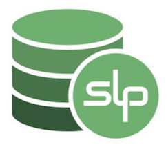

# SLPDB Readme
**Last Updated:** 2019-08-10

**Current SLPDB Version:** 0.15.3 (beta)

* 1. [What is SLPDB?](#WhatisSLPDB)
* 2. [Do you need to <u>install</u> SLPDB?](#DoyouneedtouinstalluSLPDB)
* 3. [How do I query for SLP data?](#HowdoIqueryforSLPdata)
	* 3.1. [Working with Large Numbers (`Decimal128` and `BigNumber`)](#WorkingwithLargeNumbersDecimal128andBigNumber)
* 4. [Installation Instructions](#InstallationInstructions)
	* 4.1. [Prerequisites](#Prerequisites)
	* 4.2. [Full Node Settings for `bitcoin.conf`](#FullNodeSettingsforbitcoin.conf)
    * 4.3  [BCHD & gRPC Support](#BCHDgRPCSupport)
	* 4.4. [Testnet Support](#TestnetSupport)
	* 4.5. [Running SLPDB](#RunningSLPDB)
	* 4.6. [Updating SLPDB](#UpdatingSLPDB)
* 5. [Token Stats](#TokenStats)
	* 5.1. [Supply Stats](#SupplyStats)
	* 5.2. [Summarized Usage Stats](#SummarizedUsageStats)
	* 5.3. [Supply Event Stats](#SupplyEventStats)
* 6. [Real-time Notifications](#Real-timeNotifications)
	* 6.1. [ZeroMQ (ZMQ)](#ZeroMQZMQ)
* 7. [MongoDB Collections & Data Schema](#MongoDBCollectionsDataSchema)
	* 7.1. [DB Collections](#DBCollections)
* 8. [Future Updates & Features](#FutureUpdatesFeatures)
	* 8.1. [TokenID Filtering](#TokenIDFiltering)
	* 8.2. [Make compatible with other Lokad IDs](#MakecompatiblewithotherLokadIDs)
* 9. [Change Log](#ChangeLog)

##  1. <a name='WhatisSLPDB'></a>What is SLPDB?

SLPDB is a node.js application that stores all token data for the Simple Ledger Protocol to MongoDB.  SLPDB requires MongoDB and a Bitcoin Cash full node to fetch, listen for, and store SLP data.  The application allows other processes to subscribe to real-time SLP events via ZeroMQ.


##  2. <a name='DoyouneedtouinstalluSLPDB'></a>Do you need to <u>install</u> SLPDB?

Most likely you do <u>not</u> need to install SLPDB.  Most users will be better off using someone else's public SLPDB instance like https://slpdb.bitcoin.com or https://slpdb.fountainhead.cash.  You only need to install SLPDB, SlpServe, and/or SlpSockServe projects if any of the following is true:

- You cannot rely on a third-party for your SLP data.
- SLP data query API offered at `slpdb.bitcoin.com` does not meet your needs.
- Realtime SLP data event notifications available at `slpsocket.fountainhead.cash` does not meet your needs.

NOTE: If you are going to operate a SLPDB instance you should join the telegram group for help and updates: https://t.me/slpdb


##  3. <a name='HowdoIqueryforSLPdata'></a>How do I query for SLP data?

Queries into SLP data use the jq query language.  If you are not familiar with jq we recommend that you examine some of the examples below to get started:

Here are some example SLPDB queries:

* Graph search metadata [example](https://slpdb.bitcoin.com/explorer2/ewogICJ2IjogMywKICAicSI6IHsKICAgICJhZ2dyZWdhdGUiOiBbCiAgICAgIHsiJG1hdGNoIjogeyJncmFwaFR4bi50eGlkIjogIjQxZGU3MzgxNjgxMzJhYzA2MjVmMWE1ZjcwOGRiZWQyNzBkMDM0MTgxOTVlYzZiOGM0Yzc3MDU3ZDg3N2JlZmYiIH19LAogICAgICB7IiRwcm9qZWN0IjogewogICAgICAgICAgIl9pZCI6IDAsIAogICAgICAgICAgInR4aWQiOiAiJGdyYXBoVHhuLnR4aWQiLAogICAgICAgICAgInRva2VuSWQiOiAiJHRva2VuRGV0YWlscy50b2tlbklkSGV4IiwKICAgICAgICAgICJzdGF0cyI6ICIkZ3JhcGhUeG4uc3RhdHMiCiAgICAgICAgfQogICAgICB9ICAgICAgCiAgICBdLAogICAgImxpbWl0IjogMTAKICB9Cn0=)
* Graph search for transactions to be used in local validation [example](https://slpdb.bitcoin.com/explorer2/ewogICJ2IjogMywKICAicSI6IHsKICAgICJkYiI6IFsiZyJdLAogICAgImFnZ3JlZ2F0ZSI6IFsKICAgICAgeyAiJG1hdGNoIjogewogICAgICAgICIkb3IiOiBbCiAgICAgICAgICAgIHsgImdyYXBoVHhuLnR4aWQiOiAiNDFkZTczODE2ODEzMmFjMDYyNWYxYTVmNzA4ZGJlZDI3MGQwMzQxODE5NWVjNmI4YzRjNzcwNTdkODc3YmVmZiIgfQogICAgICAgICAgXQogICAgICAgIH0KICAgICAgfSwKICAgICAgeyAiJGdyYXBoTG9va3VwIjogewogICAgICAgICAgImZyb20iOiAiZ3JhcGhzIiwKICAgICAgICAgICJzdGFydFdpdGgiOiAiJGdyYXBoVHhuLnR4aWQiLAogICAgICAgICAgImNvbm5lY3RGcm9tRmllbGQiOiAiZ3JhcGhUeG4udHhpZCIsCiAgICAgICAgICAiY29ubmVjdFRvRmllbGQiOiAiZ3JhcGhUeG4ub3V0cHV0cy5zcGVuZFR4aWQiLAogICAgICAgICAgImFzIjogImRlcGVuZHNPbiIsCiAgICAgICAgICAibWF4RGVwdGgiOiAxMDAwMCwKICAgICAgICAgICJkZXB0aEZpZWxkIjogImRlcHRoIiwKICAgICAgICAgICJyZXN0cmljdFNlYXJjaFdpdGhNYXRjaCI6IHsgCiAgICAgICAgICAgICJncmFwaFR4bi50eGlkIjogCiAgICAgICAgICAgICAgeyAiJG5pbiI6IFsKICAgICAgICAgICAgICAgICIiCiAgICAgICAgICAgICAgXQogICAgICAgICAgICB9CiAgICAgICAgICB9CiAgICAgICAgfQogICAgICB9LAogICAgICB7ICIkcHJvamVjdCI6ewogICAgICAgICAgIl9pZCI6MCwKICAgICAgICAgICJ0b2tlbklkIjogIiR0b2tlbkRldGFpbHMudG9rZW5JZEhleCIsCiAgICAgICAgICAidHhpZCI6ICIkZ3JhcGhUeG4udHhpZCIsCiAgICAgICAgICAiZGVwZW5kc09uIjogewogICAgICAgICAgICAiJG1hcCI6ewogICAgICAgICAgICAgICJpbnB1dCI6ICIkZGVwZW5kc09uLmdyYXBoVHhuLnR4aWQiLAogICAgICAgICAgICAgICJpbiI6ICIkJHRoaXMiCiAgICAgICAgICAgIH0KICAgICAgICAgIH0sCiAgICAgICAgICAiZGVwdGhzIjogewogICAgICAgICAgICAiJG1hcCI6ewogICAgICAgICAgICAgICJpbnB1dCI6ICIkZGVwZW5kc09uLmRlcHRoIiwKICAgICAgICAgICAgICAiaW4iOiAiJCR0aGlzIgogICAgICAgICAgICB9CiAgICAgICAgICB9CiAgICAgICAgfQogICAgICB9LAogICAgICB7ICIkdW53aW5kIjogewogICAgICAgICJwYXRoIjogIiRkZXBlbmRzT24iICwgImluY2x1ZGVBcnJheUluZGV4IjogImRlcGVuZHNfaW5kZXgiIAogICAgICAgIH0KICAgICAgfSwKICAgICAgeyAiJHVud2luZCI6IHsgCiAgICAgICAgInBhdGgiOiAiJGRlcHRocyIsICJpbmNsdWRlQXJyYXlJbmRleCI6ICJkZXB0aF9pbmRleCIgCiAgICAgICAgfQogICAgICB9LCAKICAgICAgeyAiJHByb2plY3QiOiB7CiAgICAgICAgICAidG9rZW5JZCI6IDEsIAogICAgICAgICAgInR4aWQiOiAxLCAKICAgICAgICAgICJkZXBlbmRzT24iOiAxLAogICAgICAgICAgImRlcHRocyI6IDEsCiAgICAgICAgICAiY29tcGFyZSI6IHsiJGNtcCI6IFsgIiRkZXBlbmRzX2luZGV4IiwgIiRkZXB0aF9pbmRleCIgXX0KICAgICAgICB9CiAgICAgIH0sCiAgICAgIHsgIiRtYXRjaCI6IHsKICAgICAgICAiY29tcGFyZSI6IDAKICAgICAgICB9CiAgICAgIH0sCiAgICAgIHsgIiRncm91cCI6IHsKICAgICAgICAgICJfaWQiOiIkZGVwZW5kc09uIiwgCiAgICAgICAgICAidHhpZCI6IHsgIiRmaXJzdCI6ICIkdHhpZCIgfSwKICAgICAgICAgICJ0b2tlbklkIjogeyAiJGZpcnN0IjogIiR0b2tlbklkIiB9LAogICAgICAgICAgImRlcHRocyI6IHsgIiRwdXNoIjogIiRkZXB0aHMiIH0KICAgICAgICB9CiAgICAgIH0sCiAgICAgIHsgIiRsb29rdXAiOiB7CiAgICAgICAgICAiZnJvbSI6ICJjb25maXJtZWQiLAogICAgICAgICAgImxvY2FsRmllbGQiOiAiX2lkIiwKICAgICAgICAgICJmb3JlaWduRmllbGQiOiAidHguaCIsCiAgICAgICAgICAiYXMiOiAidHgiCiAgICAgICAgfQogICAgICB9LAogICAgICB7ICIkcHJvamVjdCI6IHsKICAgICAgICAgICJ0eGlkIjogMSwKICAgICAgICAgICJ0b2tlbklkIjogMSwKICAgICAgICAgICJkZXB0aHMiOiAxLAogICAgICAgICAgImRlcGVuZHNPbiI6ICIkdHgudHgucmF3IiwKICAgICAgICAgICJfaWQiOiAwCiAgICAgICAgfQogICAgICB9LAogICAgICB7CiAgICAgICAgIiR1bndpbmQiOiAiJGRlcGVuZHNPbiIKICAgICAgfSwgCiAgICAgIHsKICAgICAgICAiJHVud2luZCI6ICIkZGVwdGhzIgogICAgICB9LAogICAgICB7CiAgICAgICAgIiRzb3J0IjogeyAiZGVwdGhzIjogMSB9CiAgICAgIH0sCiAgICAgIHsKICAgICAgICAiJGdyb3VwIjogewogICAgICAgICAgIl9pZCI6ICIkdHhpZCIsIAogICAgICAgICAgImRlcGVuZHNPbiI6IHsgIiRwdXNoIjogIiRkZXBlbmRzT24iIH0sCiAgICAgICAgICAiZGVwdGhzIjogeyAiJHB1c2giOiAiJGRlcHRocyIgfSwKICAgICAgICAgICJ0b2tlbklkIjogeyAiJGZpcnN0IjogIiR0b2tlbklkIiB9CiAgICAgICAgfQogICAgICB9LCAKICAgICAgewogICAgICAgICIkcHJvamVjdCI6IHsKICAgICAgICAgICJ0eGlkIjogIiRfaWQiLAogICAgICAgICAgInRva2VuSWQiOiAxLAogICAgICAgICAgImRlcGVuZHNPbiI6IDEsCiAgICAgICAgICAiZGVwdGhzIjogMSwKICAgICAgICAgICJfaWQiOiAwLCAKICAgICAgICAgICJ0eGNvdW50IjogeyAiJHNpemUiOiAiJGRlcGVuZHNPbiIgfQogICAgICAgIH0KICAgICAgfQogICAgXSwKICAgICJsaW1pdCI6IDEwMDAwCiAgfQp9)
* List all token details and usage information [example](https://slpdb.bitcoin.com/explorer2/ewogICJ2IjogMywKICAicSI6IHsKICAgICJkYiI6IFsidCJdLAogICAgImZpbmQiOgogICAgewogICAgICAiJHF1ZXJ5IjoKICAgICAgeyB9CiAgICB9LAogICAgInByb2plY3QiOiB7InRva2VuRGV0YWlscyI6IDEsICJ0b2tlblN0YXRzIjogMSwgIl9pZCI6IDAgfSwKICAgICJsaW1pdCI6IDEwMDAKICB9Cn0=)
* List all tokens as a summary of token supply [example](http://slpdb.bitcoin.com/explorer2/ewogICJ2IjogMywKICAicSI6IHsKICAgICJkYiI6IFsidCJdLAogICAgImZpbmQiOnsgICAKICAgICAgInRva2VuU3RhdHMubWludGluZ19iYXRvbl9zdGF0dXMiOiAiQUxJVkUiCiAgICB9LAogICAgInByb2plY3QiOiB7CiAgICAgICJ0b2tlbkRldGFpbHMudG9rZW5JZEhleCI6IDEsCiAgICAgICJ0b2tlblN0YXRzLnF0eV90b2tlbl9taW50ZWQiOiAxLAogICAgICAidG9rZW5TdGF0cy5xdHlfdG9rZW5fYnVybmVkIjogMSwKICAgICAgInRva2VuU3RhdHMucXR5X3Rva2VuX2NpcmN1bGF0aW5nX3N1cHBseSI6MQogICAgfSwKICAgICJzb3J0IjogeyAidG9rZW5TdGF0cy5xdHlfdG9rZW5fY2lyY3VsYXRpbmdfc3VwcGx5IjogLTEgfSwKICAgICJsaW1pdCI6IDEwMDAKICB9LAogICJyIjogewogICAgImYiOiAiWy5bXSB8IHt0b2tlbklkOiAudG9rZW5EZXRhaWxzLnRva2VuSWRIZXgsIG1pbnRlZDogLnRva2VuU3RhdHMucXR5X3Rva2VuX21pbnRlZCwgIGJ1cm5lZDogLnRva2VuU3RhdHMucXR5X3Rva2VuX2J1cm5lZCwgIGNpcmN1bGF0aW5nOiAudG9rZW5TdGF0cy5xdHlfdG9rZW5fY2lyY3VsYXRpbmdfc3VwcGx5fV0iCiAgfQp9)
* List all tokens sorted by burn amount [example](http://slpdb.bitcoin.com/explorer2/ewogICJ2IjogMywKICAicSI6IHsKICAgICJkYiI6IFsidCJdLAogICAgCiAgICAiZmluZCI6CiAgICB7CiAgICAgICIkcXVlcnkiOiB7CiAgICAgICAgIiRhbmQiOiBbewogICAgICAgICAgInRva2VuU3RhdHMubWludGluZ19iYXRvbl9zdGF0dXMiOiAiQUxJVkUiCiAgICAgICAgfSwKICAgICAgICB7CiAgICAgICAgICAidG9rZW5TdGF0cy5xdHlfdG9rZW5fYnVybmVkIjogeyAiJGd0ZSI6IDEgfQogICAgICAgIH1dCiAgICAgIH0KICAgIH0sCiAgICAicHJvamVjdCI6IHsKICAgICAgInRva2VuRGV0YWlscy50b2tlbklkSGV4IjogMSwgInRva2VuU3RhdHMucXR5X3Rva2VuX21pbnRlZCI6IDEsICJ0b2tlblN0YXRzLnF0eV90b2tlbl9idXJuZWQiOiAxLCAidG9rZW5TdGF0cy5xdHlfdG9rZW5fY2lyY3VsYXRpbmdfc3VwcGx5IjogMQogICAgfSwKICAgICJzb3J0IjogeyAidG9rZW5TdGF0cy5xdHlfdG9rZW5fYnVybmVkIjogLTEgfSwKICAgICJsaW1pdCI6IDEwMDAKICB9Cn0=)
* Token details and usage information by token ID [example](https://slpdb.bitcoin.com/explorer2/ewogICJ2IjogMywKICAicSI6IHsKICAgICJkYiI6IFsidCJdLAogICAgImZpbmQiOgogICAgewogICAgICAiJHF1ZXJ5IjoKICAgICAgewogICAgICAgICJ0b2tlbkRldGFpbHMudG9rZW5JZEhleCI6ICI5NTlhNjgxOGNiYTVhZjhhYmEzOTFkM2Y3NjQ5ZjVmNmE1Y2ViNmNkY2QyYzJhM2RjYjVkMmZiZmM0YjA4ZTk4IgogICAgICB9CiAgICB9LAogICAgInByb2plY3QiOiB7InRva2VuRGV0YWlscyI6IDEsICJ0b2tlblN0YXRzIjogMSwgIl9pZCI6IDAgfSwKICAgICJsaW1pdCI6IDEwMDAKICB9Cn0=)
* List all address balances by token ID [example](https://slpdb.bitcoin.com/explorer2/ewogICJ2IjogMywKICAicSI6IHsKICAgICJmaW5kIjogewogICAgICAidG9rZW5EZXRhaWxzLnRva2VuSWRIZXgiOiAiOTU5YTY4MThjYmE1YWY4YWJhMzkxZDNmNzY0OWY1ZjZhNWNlYjZjZGNkMmMyYTNkY2I1ZDJmYmZjNGIwOGU5OCIsCiAgICAgICJ0b2tlbl9iYWxhbmNlIjogeyAiJGd0ZSI6IDAgIH0KICAgIH0sCiAgICAibGltaXQiOiAxMDAwMCwKICAgICJwcm9qZWN0IjogeyJhZGRyZXNzIjogMSwgInNhdG9zaGlzX2JhbGFuY2UiOiAxLCAidG9rZW5fYmFsYW5jZSI6IDEsICJfaWQiOiAwIH0KICB9Cn0=)
* List all token balances by address [example](https://slpdb.bitcoin.com/explorer2/ewogICJ2IjogMywKICAicSI6IHsKICAgICJkYiI6IFsiYSJdLCAKICAgICJmaW5kIjogewogICAgICAiYWRkcmVzcyI6ICJzaW1wbGVsZWRnZXI6cXJkbDBoZWswd3ltZHV4a3k0bHFxMzd1am1lODIyYWc5eTBoejJ3dnFxIiwKICAgICAgInRva2VuX2JhbGFuY2UiOiB7ICIkZ3RlIjogMCB9CiAgICB9LAogICAgImxpbWl0IjogMTAwMDAKICB9LCAKICAiciI6IHsKICAgICJmIjogIlsuW10gfCB7IHRva2VuSWQ6IC50b2tlbkRldGFpbHMudG9rZW5JZEhleCwgc2F0b3NoaXNfYmFsYW5jZTogLnNhdG9zaGlzX2JhbGFuY2UsIHRva2VuX2JhbGFuY2U6IC50b2tlbl9iYWxhbmNlIH1dIgogIH0KfQ==)
* List all token utxos by token ID [example](https://slpdb.bitcoin.com/explorer2/ewogICJ2IjogMywKICAicSI6IHsKICAgICJkYiI6IFsieCJdLAogICAgImZpbmQiOgogICAgewogICAgICAiJHF1ZXJ5IjogeyAKICAgICAgICAidG9rZW5EZXRhaWxzLnRva2VuSWRIZXgiOiAiOTU5YTY4MThjYmE1YWY4YWJhMzkxZDNmNzY0OWY1ZjZhNWNlYjZjZGNkMmMyYTNkY2I1ZDJmYmZjNGIwOGU5OCIgCiAgICAgIH0KICAgIH0sCiAgICAibGltaXQiOiAxMDAwCiAgfSwKICAiciI6IHsKICAgICJmIjogIlsuW10gfCB7IHRva2VuSWQ6IC50b2tlbkRldGFpbHMudG9rZW5JZEhleCwgdXR4bzogLnV0eG8gfV0iCiAgfQp9)
* List transaction history by token ID [example](https://slpdb.bitcoin.com/explorer2/ewogICJ2IjogMywKICAicSI6IHsKICAgICJmaW5kIjoKICAgIHsKICAgICAgImRiIjogWyJjIiwgInUiXSwKICAgICAgIiRxdWVyeSI6CiAgICAgIHsKICAgICAgICAic2xwLmRldGFpbC50b2tlbklkSGV4IjogIjQ5NTMyMmIzN2Q2YjJlYWU4MWYwNDVlZGE2MTJiOTU4NzBhMGMyYjYwNjljNThmNzBjZjhlZjRlNmE5ZmQ0M2EiCiAgICAgIH0sCiAgICAgICIkb3JkZXJieSI6CiAgICAgIHsKICAgICAgICAiYmxrLmkiOiAtMQogICAgICB9CiAgICB9LAogICAgImxpbWl0IjogMTAwCiAgfSwKICAiciI6IHsKICAgICJmIjogIlsuW10gfCB7IHR4aWQ6IC50eC5oLCB0b2tlbkRldGFpbHM6IC5zbHAgfSBdIgogIH0KfQ==)
* List transaction history by address [example](https://slpdb.bitcoin.com/explorer2/ewogICJ2IjogMywKICAicSI6IHsKICAgICJmaW5kIjoKICAgIHsKICAgICAgImRiIjogWyJjIiwgInUiXSwKICAgICAgIiRxdWVyeSI6CiAgICAgIHsKICAgICAgICAiJG9yIjoKICAgICAgICBbCiAgICAgICAgICB7CiAgICAgICAgICAgICJpbi5lLmEiOiAicXJodmN5NXhsZWdzODU4ZmpxZjhzc2w2YTRmN3dwc3RhcWxzeTRndXN6IgogICAgICAgICAgfSwKICAgICAgICAgIHsKICAgICAgICAgICAgIm91dC5lLmEiOiAicXJodmN5NXhsZWdzODU4ZmpxZjhzc2w2YTRmN3dwc3RhcWxzeTRndXN6IgogICAgICAgICAgfQogICAgICAgIF0KICAgICAgfSwKICAgICAgIiRvcmRlcmJ5IjoKICAgICAgewogICAgICAgICJibGsuaSI6IC0xCiAgICAgIH0KICAgIH0sCiAgICAibGltaXQiOiAxMDAKICB9LAogICJyIjogewogICAgImYiOiAiWy5bXSB8IHsgdHhpZDogLnR4LmgsIHRva2VuRGV0YWlsczogLnNscCB9IF0iCiAgfQp9)
* List transaction history by address and token ID [example](https://slpdb.bitcoin.com/explorer2/ewogICJ2IjogMywKICAicSI6IHsKICAgICJmaW5kIjoKICAgIHsKICAgICAgImRiIjogWyJjIiwgInUiXSwKICAgICAgIiRxdWVyeSI6CiAgICAgIHsKICAgICAgICAiJG9yIjoKICAgICAgICBbCiAgICAgICAgICB7CiAgICAgICAgICAgICJpbi5lLmEiOiAicXJodmN5NXhsZWdzODU4ZmpxZjhzc2w2YTRmN3dwc3RhcWxzeTRndXN6IgogICAgICAgICAgfSwKICAgICAgICAgIHsKICAgICAgICAgICAgIm91dC5lLmEiOiAicXJodmN5NXhsZWdzODU4ZmpxZjhzc2w2YTRmN3dwc3RhcWxzeTRndXN6IgogICAgICAgICAgfQogICAgICAgIF0sCiAgICAgICAgInNscC5kZXRhaWwudG9rZW5JZEhleCI6ICI0OTUzMjJiMzdkNmIyZWFlODFmMDQ1ZWRhNjEyYjk1ODcwYTBjMmI2MDY5YzU4ZjcwY2Y4ZWY0ZTZhOWZkNDNhIgogICAgICB9LAogICAgICAiJG9yZGVyYnkiOgogICAgICB7CiAgICAgICAgImJsay5pIjogLTEKICAgICAgfQogICAgfSwKICAgICJsaW1pdCI6IDEwMAogIH0sCiAgInIiOiB7CiAgICAiZiI6ICJbLltdIHwgeyB0eGlkOiAudHguaCwgdG9rZW5EZXRhaWxzOiAuc2xwIH0gXSIKICB9Cn0=)
* Show invalid token transactions [example](https://slpdb.bitcoin.com/explorer2/ewogICJ2IjogMywKICAicSI6IHsKICAgICJkYiI6IFsiYyIsICJ1Il0sCiAgICAiZmluZCI6IHsKICAgICAgInNscC52YWxpZCI6IGZhbHNlCiAgICB9LAogICAgImxpbWl0IjogMzAwLAogICAgInByb2plY3QiOiB7InR4LmgiOiAxfQogIH0sCiAgInIiOiB7CiAgICAiZiI6ICJbLltdIHwge3R4aWQ6IC50eC5ofV0iCiAgfQp9)
* List transaction counts for each token [example](https://slpdb.bitcoin.com/explorer2/ewogICJ2IjogMywKICAicSI6IAogIHsiYWdncmVnYXRlIjoKICBbeyIkbWF0Y2giOnsiYmxrLnQiOnsgIiRndGUiOiAxNTUyODY3MjAwLCAiJGx0ZSI6IDE1NTI5NTM2MDB9fX0sCiAgeyIkZ3JvdXAiOnsiX2lkIjogIiRzbHAuZGV0YWlsLm5hbWUiLCAiY291bnQiOiB7IiRzdW0iOiAxfX19XSwibGltaXQiOjEwMH19)
* List SLP usage per day [example](https://slpdb.bitcoin.com/explorer2/eyJ2IjozLCJxIjp7ImRiIjpbImMiXSwiYWdncmVnYXRlIjpbeyIkbWF0Y2giOnsic2xwLnZhbGlkIjp0cnVlLCJibGsudCI6eyIkZ3RlIjoxNTQzMTcyNTY4LjIwOCwiJGx0ZSI6MTU1MzU0MDU2OC4yMDh9fX0seyIkZ3JvdXAiOnsiX2lkIjoiJGJsay50IiwiY291bnQiOnsiJHN1bSI6MX19fV0sImxpbWl0IjoxMDAwMH0sInIiOnsiZiI6IlsgLltdIHwge2Jsb2NrX2Vwb2NoOiAuX2lkLCB0eHM6IC5jb3VudH0gXSJ9fQ==)
* List input/output amount total for each valid transaction [example](https://slpdb.bitcoin.com/explorer2/ewogICJ2IjogMywKICAicSI6IHsKICAgICJkYiI6IFsiZyJdLAogICAgImFnZ3JlZ2F0ZSI6IFsgCiAgICAgIHsgIiRwcm9qZWN0Ijp7ICJncmFwaFR4bi50eGlkIjogMSwgImdyYXBoVHhuLmRldGFpbHMudHJhbnNhY3Rpb25UeXBlIjogMSwgImlucHV0VG90YWwiOiB7ICIkc3VtIjoiJGdyYXBoVHhuLmlucHV0cy5zbHBBbW91bnQiIH0sICJvdXRwdXRUb3RhbCI6IHsiJHN1bSI6IiRncmFwaFR4bi5vdXRwdXRzLnNscEFtb3VudCJ9IH19XSwKICAgICJsaW1pdCI6IDEwMDAKICB9Cn0=)

Users should utilize the [SlpServe](https://github.com/fountainhead-cash/slpserve) and [SlpSockServer](https://github.com/fountainhead-cash/slpsockserve) projects in order to conveniently query for the SLP data produced by SLPDB.


###  3.1. <a name='WorkingwithLargeNumbersDecimal128andBigNumber'></a>Working with Large Numbers (`Decimal128` and `BigNumber`)

Some of the values used in SLP require 64 or more bits of precision, which is more precision than `number` type can provide. To ensure value precision is maintained values are stored in collections using the `Decimal128` type.  `Decimal128` allows users to make database queries using query comparison operators like `$gte`.  

The services `SlpServe` and `SlpSockServer` return query results as a JSON object with `Decimal128` values converted to `string` type so that readability is improved for the query consumer, as opposed to being returned as an awkward `$DecimalNumber` JSON object.  The `string` type also maintains the original value precision.  If a user wants to perform math operations on these `string` values the user will need to first convert them to a large number type like `BigNumber` or `Decimal128` (e.g., `Decimal128.fromString("1000.123124")` or using [bignumber.js](https://github.com/MikeMcl/bignumber.js/) npm library via `new BigNumber("1000.00000001")`).


##  4. <a name='InstallationInstructions'></a>Installation Instructions

###  4.1. <a name='Prerequisites'></a>Prerequisites
* Node.js 11+
* TypeScript 3+ (`npm install -g typescript`)
* MongoDB 4.0+
* BitcoinABC, BitcoinUnlimited or other Bitcoin Cash full node with:
  * RPC-JSON and 
  * ZeroMQ event notifications

###  4.2. <a name='FullNodeSettingsforbitcoin.conf'></a>Full Node Settings for `bitcoin.conf`

The following settings should be applied to your full node's configuration.  NOTE: The settings presented here are matched up with the default settings presented in `config.ts`, you should modify these settings and use environment variables (shown in `config.ts`) if you need a custom setup.
* `server=1`
* `rpcuser=bitcoin`
* `rpcpassword=password`
* `rpcport=8332`
* `rpcworkqueue=10000`
* `rpcthreads=8`
* `zmqpubhashtx=tcp://127.0.0.1:28332`
* `zmqpubrawtx=tcp://127.0.0.1:28332`
* `zmqpubhashblock=tcp://127.0.0.1:28332`
* `zmqpubrawblock=tcp://127.0.0.1:28332`
* Optional: `testnet=1`

###  4.3. <a name='BCHDgRPCSupport'></a>BCHD & gRPC Support

High speed gRPC is supported with BCHD full nodes in place of JSON RPC and incomming ZMQ notifications.  To enable, add the environment variables `grpc_url` and `grpc_certPath`.  See the `example.env` file in this project and the [BCHD documentation](https://github.com/gcash/bchd/tree/master/docs) for more details.

###  4.4. <a name='TestnetSupport'></a>Testnet Support

To use SLPDB with Testnet simply set your full node to the testnet network (e.g., set `testnet=1` within `bitcoin.conf`) and SLPDB will automatically instantiate using proper databases names according to the network.  For informational purposes the database names are as follows:
* **Mainnet**
  * Mongo db name = `slpdb`
  * LevelDB directory = `./_leveldb`
* **Testnet**
  * Mongo db name = `slpdb_testnet`
  * Testnet diectory = `./_leveldb_testnet`

###  4.5. <a name='RunningSLPDB'></a>Running SLPDB

**1)** Run MongoDB (`config.ts` default port is 27017)

**2)** Run Bitcoin Cash full node using `bitcoin.conf` settings from above.
* [BitcoinABC](https://www.bitcoinabc.org)
* [BitcoinBU](https://www.bitcoinunlimited.info)

**3)** Install SLPDB dependencies using `npm install` at the command-line

**4)** Start SLPDB using `npm start` at the command-line and wait for sync process to complete (monitor status in the console).

* SLPDB will need to crawl the blockchain to save all *previous* SLP transaction data to MongoDB

* After crawling SLPDB will build token graphs for each token using either the raw transaction data or a previously saved token graph state.

**5)** Install and run [slpserve](https://github.com/fountainhead-cash/slpserve) and/or [slpsocket](https://github.com/simpleledger/sockserve) to access SLP token data and statistics

###  4.6. <a name='UpdatingSLPDB'></a>Updating SLPDB

**1)** Execute `git pull origin master` to update to latest version.

**2)** Execute `npm install` to update packages

**3)** Execute `npm run migrate up` to run latest migrations.

**4)** Restart SLPDB.

##  5. <a name='TokenStats'></a>Token Stats

The following properties are maintained and updated for each token in real-time to provide state and usage information:

###  5.1. <a name='SupplyStats'></a>Supply Stats
  * `qty_token_minted` - Total token quantity created in GENESIS and MINT transactions 
  * `qty_token_burned` - Total token quantity burned in invalid SLP transactions or in transactions having lower token outputs than inputs.
  * `qty_token_circulating_supply` - Total quantity of tokens circulating (i.e., Genesis + Minting - Burned = Circulating Supply).
  * `minting_baton_status`  - State of the minting baton (possible baton status: `ALIVE`, `NEVER_CREATED`, `DEAD_BURNED`, or `DEAD_ENDED`).
  * `mint_baton_address (NOT YET IMPLEMENTED)` - Address holding the minting baton or last address to hold.
  * `mint_baton_txid (NOT YET IMPLEMENTED)` - TXID where the minting baton exists or existed before being destroyed.

###  5.2. <a name='SummarizedUsageStats'></a>Summarized Usage Stats
  * `qty_valid_txns_since_genesis` - Number of valid SLP transactions made since Genesis (Includes GENESIS, SEND and MINT transactions)
  * `qty_valid_token_utxos` - Number of current unspent & valid SLP UTXOs
  * `qty_valid_token_addresses` - Number of unique address holders
  * `qty_satoshis_locked_up` - Quantity of BCH that is locked up in SLP UTXOs
  * `block_last_active_mint` - The block containing the token's MINT transaction
  * `block_last_active_send` - The block containing the token's SEND transaction
  * `block_created` - The block containing the token's GENESIS transaction
  * `block_last_burn (NOT YET IMPLEMENTED)` - The block containing the last burn event

###  5.3. <a name='SupplyEventStats'></a>Supply Event Stats
  * `events_mint (NOT YET IMPLEMENTED)` - Events when the minting baton was moved and new tokens were created
  * `events_burn (NOT YET IMPLEMENTED)` - Events when tokens were burned (possible type of burn: `OUTS_LESS_THAN_INS` or `UTXO_DESTROYED`)


##  6. <a name='Real-timeNotifications'></a>Real-time Notifications

###  6.1. <a name='ZeroMQZMQ'></a>ZeroMQ (ZMQ)

SLPDB publishes the following notifications via [ZMQ](http://zeromq.org/intro:read-the-manual) and can be subscribed to by binding to http://0.0.0.0:28339.  The following events can be subscribed to:
* `mempool`
* `block`

Each notification is published in the following data format:

```js
{
    "tx": {
        h: string; 
    };
    "in": Xput[];
    "out": Xput[];
    "blk": { 
        h: string; 
        i: number; 
        t: number; 
    };
    "slp": {
        valid: boolean|null;
        detail: {
            transactionType: SlpTransactionType;
            tokenIdHex: string;
            versionType: number;
            symbol: string;
            name: string;
            documentUri: string; 
            documentSha256Hex: string|null;
            decimals: number;
            txnContainsBaton: boolean;
            txnBatonVout: number|null;
        } | null;
        outputs: { address: string|null, amount: Decimal128|null }[]|null;|null;
        invalidReason: string|null;
        schema_version: number;
    };
}
```


##  7. <a name='MongoDBCollectionsDataSchema'></a>MongoDB Collections & Data Schema

Three categories of information are stored in MongoDB:

1. Valid and invalid SLP token transactions,  
2. Statistical calculations about each token, and 
3. Token graph state 


###  7.1. <a name='DBCollections'></a>DB Collections

Six MongoDB collections used to store these three categories of data, they are as follows:

 * `confirmed = c`  and `unconfirmed = u` 

    * **Purpose**: These two collections include any Bitcoin Cash transaction containing the "SLP" Lokad ID.  The collection used depends on the transaction's confirmation status . Both valid and invalid SLP transactions are included.  Whenever new SLP transactions are added to the Bitcoin Cash network they are immediately added to one of these collections.

    * **Schema**:

    ```js
    {
        "tx": {
            h: string; 
        };
        "in": Xput[];
        "out": Xput[];
        "blk": { 
            h: string; 
            i: number; 
            t: number; 
        };
        "slp": {
            valid: boolean|null;
            detail: {
                transactionType: SlpTransactionType;
                tokenIdHex: string;
                versionType: number;
                symbol: string;
                name: string;
                documentUri: string; 
                documentSha256Hex: string|null;
                decimals: number;
                txnContainsBaton: boolean;
                txnBatonVout: number|null;
            } | null;
            invalidReason: string|null;
            schema_version: number;
        };
    }
    ```

      

 * `tokens = t` 

    * **Purpose**: This collection includes metadata and statistics about each token.  Each time SLPDB has finished updating a token graph the associated items in this collection are updated.

    * **Schema**:

	```js
    {
        "tokenDetails": {
            transactionType: SlpTransactionType;
            tokenIdHex: string;
            versionType: number;
            timestamp: string|null;
            timestamp_unix: number|null;
            symbol: string;
            name: string;
            documentUri: string; 
            documentSha256Hex: string|null;
            decimals: number;
            containsBaton: boolean;
            batonVout: number|null;
            genesisOrMintQuantity: Decimal128|null;
            sendOutputs: Decimal128[]|null;
        };
        "tokenStats": {
            block_created: number|null;
            block_last_active_send: number|null;
            block_last_active_mint: number|null;
            qty_valid_txns_since_genesis: number;
            qty_valid_token_utxos: number;
            qty_valid_token_addresses: number;
            qty_token_minted: Decimal128;
            qty_token_burned: Decimal128;
            qty_token_circulating_supply: Decimal128;
            qty_satoshis_locked_up: number;
            minting_baton_status: TokenBatonStatus;
        }
        "lastUpdatedBlock": number;
        "schema_version": number;
    }
	```

      

 * `utxos = x` 

    * **Purpose**: This collection contains an item for each valid UTXO holding a token (does not include mint baton UTXOs).

    * **Schema**:

	```js
    {
        "tokenDetails": { 
            tokenIdHex: string;
        };
        "utxo": string; // formatted as <txid>:<vout>
    }
	```

      

 * `addresses = a` 

    * **Purpose**: This collection contains an item for each addresses holding a valid token balance, for each token.

    * **Schema**:

	```js
    {
        "tokenDetails": { 
            tokenIdHex: string 
        };
        "address": cashAddr;
        "satoshis_balance": number;
        "token_balance": Decimal128;
    }
	```

      

 * `graphs = g` 

    * **Purpose**: This collection contains an item for each <u>valid</u> SLP transaction (can be GENESIS, MINT, or SEND)

    * **Schema**:

	```js
    {
        "tokenDetails": { 
            tokenIdHex: string 
        };
        "graphTxn": {
            txid: string;
            details: SlpTransactionDetailsDbo;
            outputs: GraphTxnOutputDbo[];
        };
    }
	```

      
##  8. <a name='FutureUpdatesFeatures'></a>Future Updates & Features

###  8.1. <a name='TokenIDFiltering'></a>TokenID Filtering

SLPDB will soon include a filtering configuration so that only user specified tokens (or ranges of tokens) will be included or excluded in the SLPDB instance.

###  8.2. <a name='MakecompatiblewithotherLokadIDs'></a>Make compatible with other Lokad IDs

We want to make SLPDB more easily forkable for other OP_RETURN projects which may be unrelated to SLP tokens.

## 9. <a name='ChangeLog'></a>Change Log

* 0.15.3
    * Additional db cleanup needed in graphs collection from the issue fixed in 0.15.2
    * Removed unneeded object initializers in FromDbObjects, moved to TokenGraph constructor

* 0.15.2
	* Fixed issue with address format occurring when restarting SLPDB
	* Cleaned up readme file formatting (Jt)

* 0.15.1
	* Fix issue with minting baton status update on initiating token from scratch

* 0.15.0
	* Add Graph Search metadata (see example queries above for search examples)
	* Start listening to blockchain updates before the startup process for improved data integrity during long startup periods
	* Fixed bug where not all inputs were showing up in graph transactions
	* Replaced getinfo RPC in favor of getBlockchainInfo
	* Fixed issue with tokens collection items missing "block_created" data

* 0.14.1
	* Improved token burn detection after a new blocks is broadcast
	* Updated to slpjs version 0.21.1 with caching bug fix.
	* Updated updateTxnCollections() so that any valid transactions erroneously marked as "invalid" get updated.
	* Refactored several methods to use destructured method parameters
	* Other minor refactors and improvements

* 0.14.0
	* Added NFT1 support
	* Improved token burn detection on new block event
	* Prevent duplicate zmq transaction publish notifications
	* Various bug fixes and improvements

* 0.13.0
	* Breaking Change: This change may impact any application using `TokenUtxoStatus` or the Graph collection's `graphTxn.outputs.status` property. A new enum type was added to `TokenUtxoStatus` called "EXCESS_INPUT_BURNED".  This status is applied to any transaction that has an input SLP quantity that is greater than output SLP quantity.  This enum label is used within the Graphs collection's `graphTxn.outputs.status` property.
	* A new startup script called "reprocess" was added for the pupose of debugging.  Usage is `node index.js reprocess <tokenId>`.
	* Fixed issue with block and mempool item cache used to ignore duplicate zmq notifications
	* Fixed testnet config starting block (off by one)
	* P2MS and P2PK output addresses are stored as `scriptPubKey:<hex>`
	* Reduced number of RPC calls by subscribing to zmq 'rawtx' instead of 'hashtx'
	* Other minor improvements
